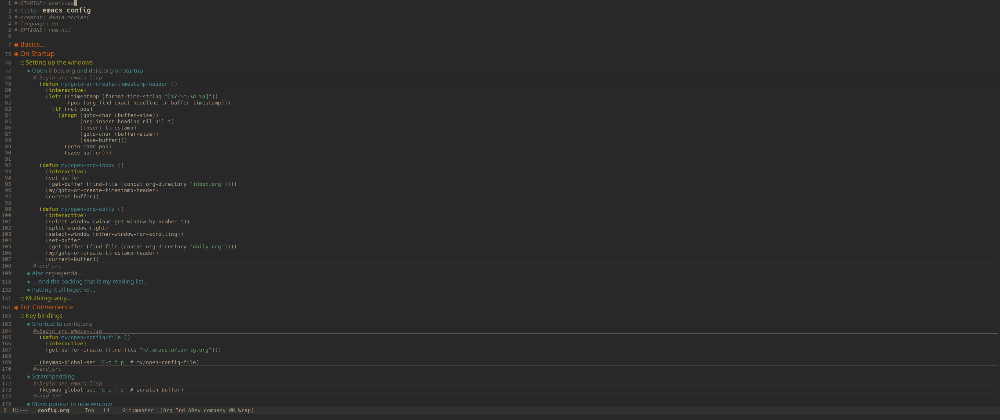
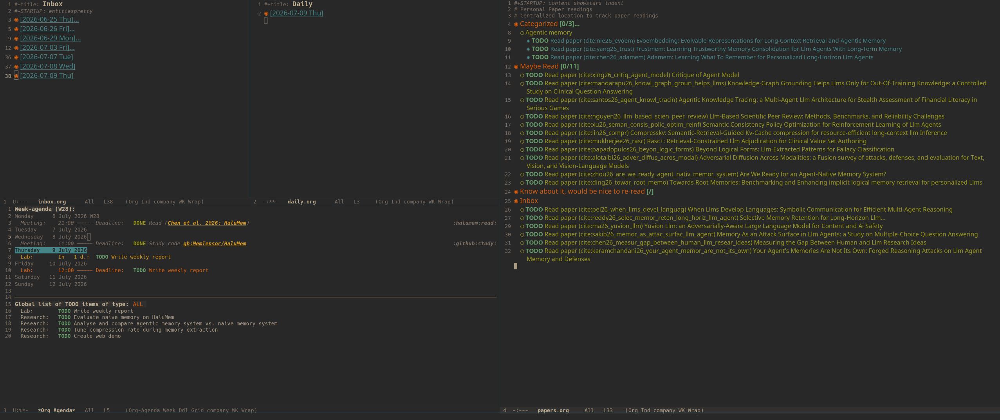

#+STARTUP: overview inlineimages
#+title: dania moriazi's emacs config
#+CREATOR: dania moriazi
#+LANGUAGE: en
#+OPTIONS: num:nil

Because version control.

* Screenshots
** =config.org=

** Start-up page

